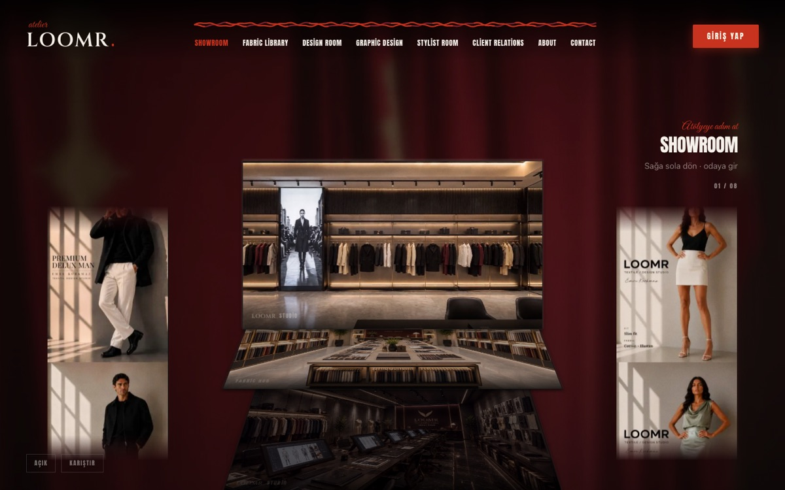
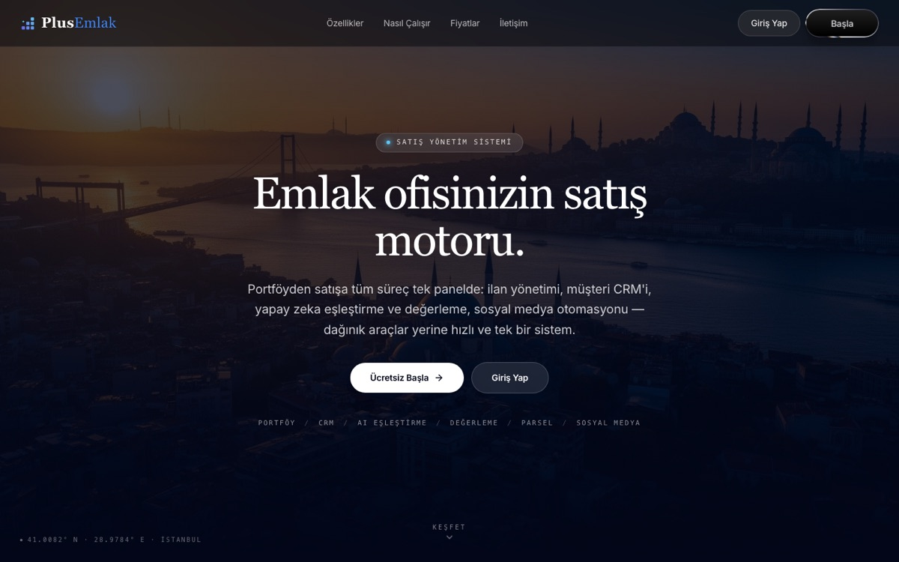

#### What I work on

- **Cloud infrastructure** — production on AWS and Azure, infrastructure in Terraform, least-privilege IAM,
  secrets in SSM, backups and alarms
- **Containers and delivery** — Docker images, Helm charts, CI/CD pipelines with test gates and
  image scanning, automated deploys
- **The products on top** — SaaS platforms (real estate CRM, warehouse management), AI products,
  and iOS / Android apps with React Native

Most of it is private: products I own, build with partners, or deliver to clients.

#### Shipped

<table>
<tr>
<td width="50%" valign="top">

 <b><a href="https://www.loomr.net">LOOMR</a></b> — the platform site for a fashion design
studio: an interactive atelier with showroom, fabric library, design and stylist rooms.
</td>
<td width="50%" valign="top">

 <b><a href="https://3.74.95.123.sslip.io">PlusEmlak</a></b> — CRM and automation for real
estate offices: listings, client CRM, AI matching and valuation, social media automation.
</td>
</tr>
</table>

#### Public repos

| Repo | |
| --- | --- |
| [prod-saas-aws](https://github.com/egezamb/prod-saas-aws) | Production SaaS on AWS in Terraform — ECS Fargate, RDS, ALB, observability, cost breakdown |
| [cloud-infrastructure](https://github.com/egezamb/cloud-infrastructure) | Case studies of production infrastructure I've built and run |
| [spacefit](https://github.com/egezamb/spacefit) | Virtual fitting room — React + Gemini vision |
| [ege-portfolio-2025](https://github.com/egezamb/ege-portfolio-2025) | Portfolio — Next.js, TypeScript, Tailwind, TR / PL / EN |
| [aws-terraform-starter](https://github.com/egezamb/aws-terraform-starter) | Secure-by-default Terraform starter for AWS |
| [TSP-sales-problem](https://github.com/egezamb/TSP-sales-problem) | Genetic algorithm for the travelling salesman problem, live visualisation |
